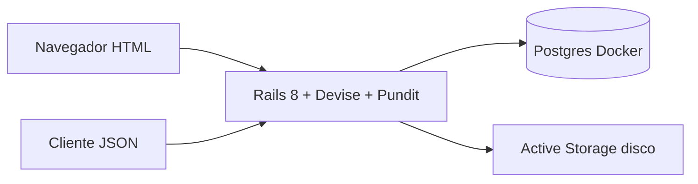

# Resolve Aí

MVP em Rails 8 (PostgreSQL, Tailwind, importmap e Stimulus) para a POSTECH FSDT Fase 5 — gestão de ocorrências de condomínio.

Diagramas e detalhe de domínio:

- [Arquitetura](docs/arquitetura.md)
- [Fluxos por perfil](docs/perfis.md)
- [Ciclo de vida](docs/ciclo-de-vida.md)



O cadastro público cria um **solicitante** (`requester`). Os gestores (`manager`) vêm do seed. O HTML e a API compartilham o mesmo domínio e as mesmas policies.

## Configuração local

Ruby 3.3.7, Docker e Bundler.

```bash
docker compose up -d db
bin/setup --skip-server
bin/dev
```

O `bin/setup` instala as gems e prepara o banco. O `bin/dev` sobe o Puma e o Tailwind.

O Postgres roda no Compose (`postgres:16`) em **localhost:5432** (`postgres` / `postgres`). Se essa porta já estiver em uso:

```bash
POSTGRES_PUBLISH_PORT=5433 docker compose up -d db
POSTGRES_PORT=5433 bin/setup --skip-server
POSTGRES_PORT=5433 bin/dev
```

O `Dockerfile` voltado para produção está incluído; em desenvolvimento a aplicação roda no host. Para testar a aplicação em container: `docker compose --profile app up`.

Depois do `bin/setup` (ou `bin/rails db:seed`), os usuários de demonstração são:

| Perfil       | E-mail               | Senha       |
| ------------ | -------------------- | ----------- |
| Gestor       | manager@resolve.ai   | password123 |
| Solicitante  | requester@resolve.ai | password123 |
| Solicitante  | marina@resolve.ai    | password123 |

O cadastro público sempre cria um `requester`. Gestores vêm do seed (ou são criados no console).

Os seeds cobrem os 5 status e várias categorias (iluminação, equipamento, vazamento, acessibilidade, limpeza, segurança, manutenção, outros).

## Testes

```bash
bundle exec rspec
```

## API v1

API JSON na mesma aplicação Rails. A autenticação usa o **cookie de sessão** do Devise (sem JWT). O CSRF é ignorado em `/api/*`; envie o `Cookie` depois do login (no curl: `-c` / `-b`).

URL base: `http://localhost:3000/api/v1`. Envie `Accept: application/json`. Os valores dos enums coincidem com os modelos: status `open`, `in_analysis`, `in_progress`, `resolved`, `cancel`; papéis `requester` / `manager`; categorias `lighting`, `equipment`, `accessibility`, `cleaning`, `leakage`, `security`, `maintenance`, `other`; prioridades `low`, `medium`, `high`, `urgent`.

| Método   | Caminho                              | Quem                    | O que                                                                                          |
| -------- | ------------------------------------ | ----------------------- | ---------------------------------------------------------------------------------------------- |
| `POST`   | `/api/v1/sessions`                   | Público                 | Entrar (`email`, `password`)                                                                   |
| `DELETE` | `/api/v1/sessions`                   | Autenticado             | Sair                                                                                           |
| `GET`    | `/api/v1/occurrences`                | Ambos                   | Listar (filtros `status`, `category`, `priority`). Solicitante: apenas as próprias ocorrências |
| `POST`   | `/api/v1/occurrences`                | Solicitante             | Criar (`title`, `description`, `location`, `category`, `photo` opcional)                      |
| `GET`    | `/api/v1/occurrences/:id`            | Dono ou gestor          | Detalhe com `comments`, `events`, `photo_url`                                                  |
| `PATCH`  | `/api/v1/occurrences/:id`            | Gestor                  | `priority`, `assignee_id`, `status` + `note` obrigatória, `resolution_notes` ao resolver       |
| `POST`   | `/api/v1/occurrences/:id/comments`   | Dono ou gestor          | `{ "comment": { "body": "..." } }`                                                            |
| `POST`   | `/api/v1/occurrences/:id/rating`     | Dono, se `resolved`     | `{ "rating": 1-5, "rating_comment": "..." }`                                                   |
| `GET`    | `/api/v1/dashboard`                  | Gestor                  | Totais por status/categoria, abertas vs resolvidas, média de horas até a resolução            |

O Devise em HTML (`POST /users/sign_in`) também define o mesmo cookie, se preferir o formulário do navegador.

### Exemplos com curl

```bash
# Entrar (grava o cookie de sessão)
curl -sS -c /tmp/resolve-ai-cookies -b /tmp/resolve-ai-cookies \
  -H 'Content-Type: application/json' -H 'Accept: application/json' \
  -d '{"email":"requester@resolve.ai","password":"password123"}' \
  http://localhost:3000/api/v1/sessions

# Listar minhas ocorrências
curl -sS -b /tmp/resolve-ai-cookies -H 'Accept: application/json' \
  http://localhost:3000/api/v1/occurrences

# Criar (JSON, sem foto)
curl -sS -b /tmp/resolve-ai-cookies \
  -H 'Content-Type: application/json' -H 'Accept: application/json' \
  -d '{"occurrence":{"title":"Lâmpada queimada","description":"Corredor escuro.","location":"Bloco B, 3º andar","category":"lighting"}}' \
  http://localhost:3000/api/v1/occurrences

# Criar com foto (multipart)
curl -sS -b /tmp/resolve-ai-cookies -H 'Accept: application/json' \
  -F 'occurrence[title]=Vazamento no hall' \
  -F 'occurrence[description]=Poça perto do elevador.' \
  -F 'occurrence[location]=Bloco A, térreo' \
  -F 'occurrence[category]=leakage' \
  -F 'occurrence[photo]=@photo.png;type=image/png' \
  http://localhost:3000/api/v1/occurrences

# Detalhe
curl -sS -b /tmp/resolve-ai-cookies -H 'Accept: application/json' \
  http://localhost:3000/api/v1/occurrences/1
```

Fluxo do gestor (entrar como `manager@resolve.ai`):

```bash
curl -sS -c /tmp/resolve-ai-cookies -b /tmp/resolve-ai-cookies \
  -H 'Content-Type: application/json' -H 'Accept: application/json' \
  -d '{"email":"manager@resolve.ai","password":"password123"}' \
  http://localhost:3000/api/v1/sessions

# Filtro da caixa de entrada
curl -sS -b /tmp/resolve-ai-cookies -H 'Accept: application/json' \
  'http://localhost:3000/api/v1/occurrences?status=open&priority=high'

# Prioridade, responsável e depois status (a observação é obrigatória)
curl -sS -b /tmp/resolve-ai-cookies -H 'Content-Type: application/json' -H 'Accept: application/json' \
  -d '{"occurrence":{"priority":"high"}}' \
  -X PATCH http://localhost:3000/api/v1/occurrences/1

curl -sS -b /tmp/resolve-ai-cookies -H 'Content-Type: application/json' -H 'Accept: application/json' \
  -d '{"occurrence":{"assignee_id":1}}' \
  -X PATCH http://localhost:3000/api/v1/occurrences/1

curl -sS -b /tmp/resolve-ai-cookies -H 'Content-Type: application/json' -H 'Accept: application/json' \
  -d '{"occurrence":{"status":"in_analysis","note":"Vistoria agendada."}}' \
  -X PATCH http://localhost:3000/api/v1/occurrences/1

# Resolver
curl -sS -b /tmp/resolve-ai-cookies -H 'Content-Type: application/json' -H 'Accept: application/json' \
  -d '{"occurrence":{"status":"resolved","note":"Concluído","resolution_notes":"Lâmpada substituída."}}' \
  -X PATCH http://localhost:3000/api/v1/occurrences/1

# Painel
curl -sS -b /tmp/resolve-ai-cookies -H 'Accept: application/json' \
  http://localhost:3000/api/v1/dashboard
```

Comentário e avaliação (solicitante, depois que a ocorrência estiver `resolved`):

```bash
curl -sS -b /tmp/resolve-ai-cookies -H 'Content-Type: application/json' -H 'Accept: application/json' \
  -d '{"comment":{"body":"Obrigado pelo retorno."}}' \
  http://localhost:3000/api/v1/occurrences/1/comments

curl -sS -b /tmp/resolve-ai-cookies -H 'Content-Type: application/json' -H 'Accept: application/json' \
  -d '{"rating":5,"rating_comment":"Rápido."}' \
  http://localhost:3000/api/v1/occurrences/1/rating
```

Sair:

```bash
curl -sS -b /tmp/resolve-ai-cookies -c /tmp/resolve-ai-cookies -X DELETE \
  -H 'Accept: application/json' \
  http://localhost:3000/api/v1/sessions
```

Um único `PATCH` do gestor pode definir `priority`, `assignee_id` e `status` juntos. Mudar o status exige `note`. Se algum passo falhar, a atualização inteira é revertida. Movimentos permitidos: `open → in_analysis → in_progress → resolved`, ou `cancel` a partir de `open`, `in_analysis` ou `in_progress`.

`GET /api/v1/dashboard` devolve `total`, `open_count`, `resolved_count`, `average_resolution_hours`, `status_counts` e `category_counts`. `GET /api/v1/occurrences/:id` inclui `comments`, `events` e `photo_url`.

Erros devolvem `{ "error": "..." }` com `401` (não autenticado), `403` (proibido), `404` (fora do escopo) ou `422` (validação / transição inválida). Respostas de validação também podem incluir `"errors": []`.
