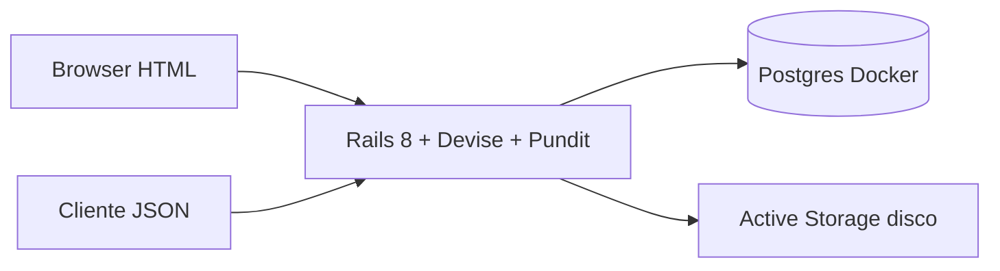

# Resolve Aí

MVP Rails 8 (PostgreSQL, Tailwind, importmap, Stimulus) for POSTECH FSDT Fase 5 — gestão de ocorrências de condomínio.

Diagramas e detalhe de domínio:

- [Arquitetura](docs/arquitetura.md)
- [Fluxos por perfil](docs/perfis.md)
- [Ciclo de vida](docs/ciclo-de-vida.md)



Cadastro público cria **solicitante** (`requester`). Gestores (`manager`) vêm do seed. O HTML e a API compartilham o mesmo domínio e as mesmas policies.

## Local setup

Ruby 3.3.7, Docker, and Bundler.

```bash
docker compose up -d db
bin/setup --skip-server
bin/dev
```

`bin/setup` installs gems and prepares the database. `bin/dev` runs Puma + Tailwind.

Postgres runs in Compose (`postgres:16`) on **localhost:5432** (`postgres` / `postgres`). If that port is already taken:

```bash
POSTGRES_PUBLISH_PORT=5433 docker compose up -d db
POSTGRES_PORT=5433 bin/setup --skip-server
POSTGRES_PORT=5433 bin/dev
```

The production-oriented `Dockerfile` is included; the app itself is meant to run on the host during development. To try the containerized app: `docker compose --profile app up`.

After `bin/setup` (or `bin/rails db:seed`), demo users are:

| Perfil    | E-mail               | Senha       |
| --------- | -------------------- | ----------- |
| Manager   | manager@resolve.ai   | password123 |
| Requester | requester@resolve.ai | password123 |
| Requester | marina@resolve.ai    | password123 |

Public sign-up at `/users/sign_up` (linked from the sign-in page as "Criar conta") always creates a `requester` and signs them in. Managers are seeded (or created in the console).

Seeds cobrem os 5 status e várias categorias (iluminação, equipamento, vazamento, acessibilidade, limpeza, segurança, manutenção, outros).

## Testes

```bash
bundle exec rspec
```

## Deploy (Fly.io)

`fly.toml` runs the production `Dockerfile` as app `resolve-ai-mvp-fiap` in `gru`: Thruster on port 8080, Solid Queue inside Puma, uploads on a Fly volume mounted at `/rails/storage`. The entrypoint runs `db:prepare` on boot, so the first deploy creates the four databases (primary, cache, queue, cable) and loads the seeds.

One-time setup (unmanaged Fly Postgres, superuser so `db:prepare` can create the databases):

```bash
fly apps create resolve-ai-mvp-fiap
fly postgres create --name resolve-ai-mvp-fiap-db --region gru \
  --initial-cluster-size 1 --vm-size shared-cpu-1x --volume-size 1

PG="postgres://postgres:<password>@resolve-ai-mvp-fiap-db.flycast:5432"
fly secrets set --stage -a resolve-ai-mvp-fiap \
  SECRET_KEY_BASE=$(openssl rand -hex 64) \
  DATABASE_URL="$PG/resolve_ai_mvp_fiap_production" \
  CACHE_DATABASE_URL="$PG/resolve_ai_mvp_fiap_production_cache" \
  QUEUE_DATABASE_URL="$PG/resolve_ai_mvp_fiap_production_queue" \
  CABLE_DATABASE_URL="$PG/resolve_ai_mvp_fiap_production_cable"

fly volumes create storage --region gru --size 1 -a resolve-ai-mvp-fiap -y
```

Deploy (single machine, since the volume is attached to one):

```bash
fly deploy --ha=false
```

## API v1

JSON API on the same Rails app. Auth is a Devise **session cookie** (no JWT). CSRF is skipped on `/api/*`; send `Cookie` after login (curl: `-c` / `-b`).

Base URL: `http://localhost:3000/api/v1`. Send `Accept: application/json`. Enum values match the models: statuses `open`, `in_analysis`, `in_progress`, `resolved`, `cancel`; roles `requester` / `manager`; categories `lighting`, `equipment`, `accessibility`, `cleaning`, `leakage`, `security`, `maintenance`, `other`; priorities `low`, `medium`, `high`, `urgent`.

| Method | Path | Who | What |
| ------ | ---- | --- | ---- |
| `POST` | `/api/v1/sessions` | Public | Sign in (`email`, `password`) |
| `DELETE` | `/api/v1/sessions` | Signed in | Sign out |
| `GET` | `/api/v1/occurrences` | Both | List (`status`, `category`, `priority` filters). Requester: own rows only |
| `POST` | `/api/v1/occurrences` | Requester | Create (`title`, `description`, `location`, `category`, optional `photo`) |
| `GET` | `/api/v1/occurrences/:id` | Owner or manager | Detail with `comments`, `events`, `photo_url` |
| `PATCH` | `/api/v1/occurrences/:id` | Manager | `priority`, `assignee_id`, `status` + required `note`, `resolution_notes` when resolving |
| `POST` | `/api/v1/occurrences/:id/comments` | Owner or manager | `{ "comment": { "body": "..." } }` |
| `POST` | `/api/v1/occurrences/:id/rating` | Owner, if `resolved` | `{ "rating": 1-5, "rating_comment": "..." }` |
| `GET` | `/api/v1/dashboard` | Manager | Totals by status/category, open vs resolved, average resolution hours |

HTML Devise (`POST /users/sign_in`) also sets the same cookie if you prefer the browser form.

### curl examples

```bash
# Sign in (stores session cookie)
curl -sS -c /tmp/resolve-ai-cookies -b /tmp/resolve-ai-cookies \
  -H 'Content-Type: application/json' -H 'Accept: application/json' \
  -d '{"email":"requester@resolve.ai","password":"password123"}' \
  http://localhost:3000/api/v1/sessions

# List my occurrences
curl -sS -b /tmp/resolve-ai-cookies -H 'Accept: application/json' \
  http://localhost:3000/api/v1/occurrences

# Create (JSON, no photo)
curl -sS -b /tmp/resolve-ai-cookies \
  -H 'Content-Type: application/json' -H 'Accept: application/json' \
  -d '{"occurrence":{"title":"Lâmpada queimada","description":"Corredor escuro.","location":"Bloco B, 3º andar","category":"lighting"}}' \
  http://localhost:3000/api/v1/occurrences

# Create with photo (multipart)
curl -sS -b /tmp/resolve-ai-cookies -H 'Accept: application/json' \
  -F 'occurrence[title]=Vazamento no hall' \
  -F 'occurrence[description]=Poça perto do elevador.' \
  -F 'occurrence[location]=Bloco A, térreo' \
  -F 'occurrence[category]=leakage' \
  -F 'occurrence[photo]=@photo.png;type=image/png' \
  http://localhost:3000/api/v1/occurrences

# Detail
curl -sS -b /tmp/resolve-ai-cookies -H 'Accept: application/json' \
  http://localhost:3000/api/v1/occurrences/1
```

Manager flow (sign in as `manager@resolve.ai`):

```bash
curl -sS -c /tmp/resolve-ai-cookies -b /tmp/resolve-ai-cookies \
  -H 'Content-Type: application/json' -H 'Accept: application/json' \
  -d '{"email":"manager@resolve.ai","password":"password123"}' \
  http://localhost:3000/api/v1/sessions

# Inbox filter
curl -sS -b /tmp/resolve-ai-cookies -H 'Accept: application/json' \
  'http://localhost:3000/api/v1/occurrences?status=open&priority=high'

# Priority, assignee, then status (note is required)
curl -sS -b /tmp/resolve-ai-cookies -H 'Content-Type: application/json' -H 'Accept: application/json' \
  -d '{"occurrence":{"priority":"high"}}' \
  -X PATCH http://localhost:3000/api/v1/occurrences/1

curl -sS -b /tmp/resolve-ai-cookies -H 'Content-Type: application/json' -H 'Accept: application/json' \
  -d '{"occurrence":{"assignee_id":1}}' \
  -X PATCH http://localhost:3000/api/v1/occurrences/1

curl -sS -b /tmp/resolve-ai-cookies -H 'Content-Type: application/json' -H 'Accept: application/json' \
  -d '{"occurrence":{"status":"in_analysis","note":"Vistoria agendada."}}' \
  -X PATCH http://localhost:3000/api/v1/occurrences/1

# Resolve
curl -sS -b /tmp/resolve-ai-cookies -H 'Content-Type: application/json' -H 'Accept: application/json' \
  -d '{"occurrence":{"status":"resolved","note":"Concluído","resolution_notes":"Lâmpada substituída."}}' \
  -X PATCH http://localhost:3000/api/v1/occurrences/1

# Dashboard
curl -sS -b /tmp/resolve-ai-cookies -H 'Accept: application/json' \
  http://localhost:3000/api/v1/dashboard
```

Comment and rating (requester, after the occurrence is `resolved`):

```bash
curl -sS -b /tmp/resolve-ai-cookies -H 'Content-Type: application/json' -H 'Accept: application/json' \
  -d '{"comment":{"body":"Obrigado pelo retorno."}}' \
  http://localhost:3000/api/v1/occurrences/1/comments

curl -sS -b /tmp/resolve-ai-cookies -H 'Content-Type: application/json' -H 'Accept: application/json' \
  -d '{"rating":5,"rating_comment":"Rápido."}' \
  http://localhost:3000/api/v1/occurrences/1/rating
```

Sign out:

```bash
curl -sS -b /tmp/resolve-ai-cookies -c /tmp/resolve-ai-cookies -X DELETE \
  -H 'Accept: application/json' \
  http://localhost:3000/api/v1/sessions
```

One manager `PATCH` can set `priority`, `assignee_id`, and `status` together. Changing status requires `note`. If any step fails, the whole update is rolled back. Allowed moves: `open → in_analysis → in_progress → resolved`, or `cancel` from `open`, `in_analysis`, or `in_progress`.

`GET /api/v1/dashboard` returns `total`, `open_count`, `resolved_count`, `average_resolution_hours`, `status_counts`, and `category_counts`. `GET /api/v1/occurrences/:id` adds `comments`, `events`, and `photo_url`.

Errors return `{ "error": "..." }` with `401` (unauthenticated), `403` (forbidden), `404` (not in scope), or `422` (validation / invalid transition). Validation payloads may also include `"errors": []`.
