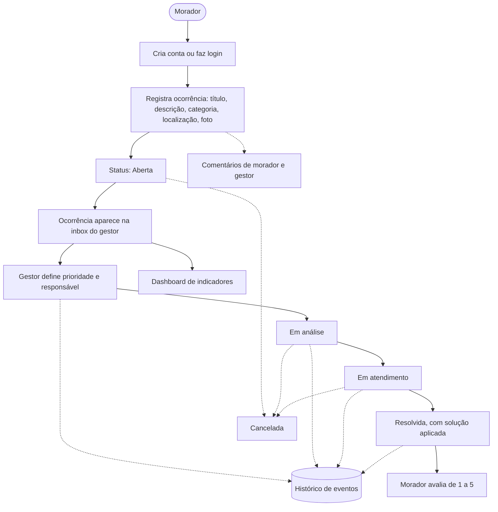
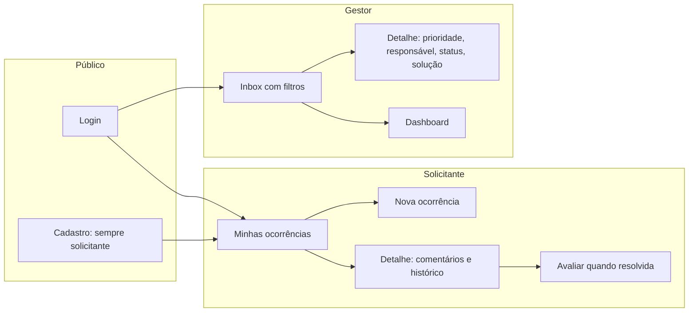
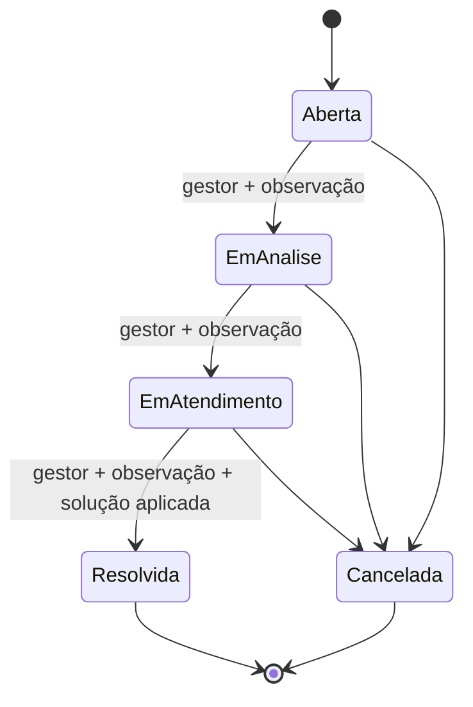
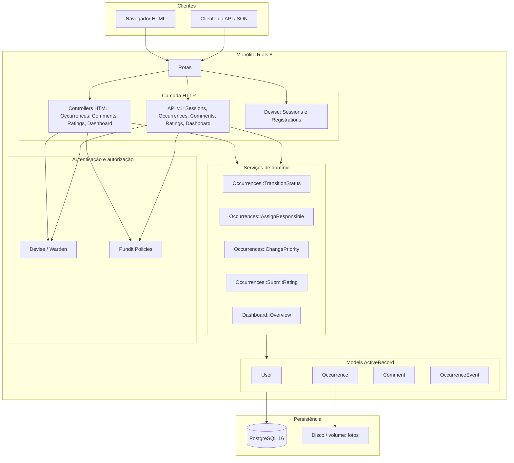
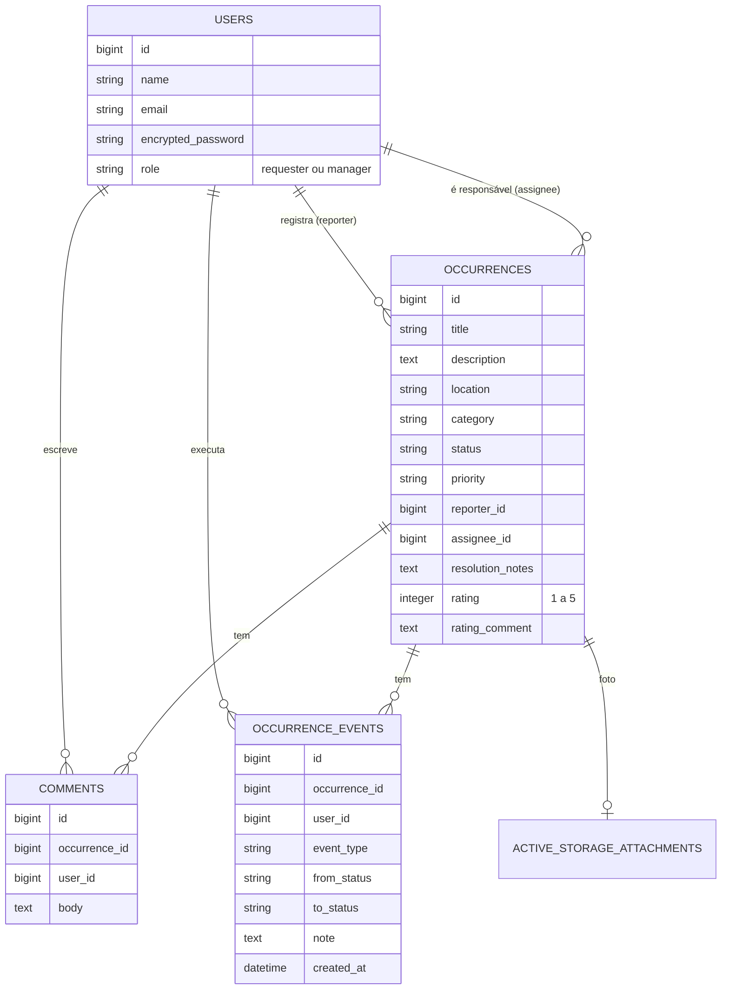
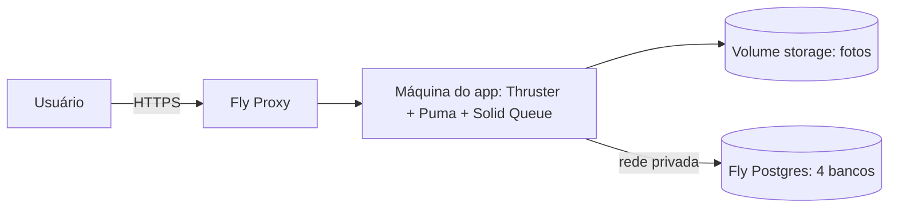

# Resolve Aí — Plataforma de Gestão de Ocorrências

MVP de uma plataforma para registrar e resolver ocorrências de condomínio. Moradores registram problemas e acompanham cada um até a resolução. O gestor prioriza, atribui um responsável, atualiza o status e acompanha os indicadores.

| | |
| --- | --- |
| Aplicação publicada | https://resolve-ai-mvp-fiap.fly.dev |
| Repositório | https://github.com/LSalmada/resolve-ai-mvp-fiap |

Usuários de demonstração (senha `password123`): `manager@resolve.ai` (gestor), `requester@resolve.ai` e `marina@resolve.ai` (solicitantes). Novos solicitantes podem usar **Criar conta** na tela de login.

## Sumário

1. [Sobre o MVP](#1-sobre-o-mvp)
2. [Funcionalidades por perfil](#2-funcionalidades-por-perfil)
3. [Fluxogramas](#3-fluxogramas)
4. [Arquitetura de software](#4-arquitetura-de-software)
5. [Banco de dados](#5-banco-de-dados)
6. [Backend](#6-backend)
7. [API](#7-api)
8. [Frontend](#8-frontend)
9. [Como rodar localmente](#9-como-rodar-localmente)
10. [Docker](#10-docker)
11. [Testes e qualidade](#11-testes-e-qualidade)
12. [Deploy em cloud (Fly.io)](#12-deploy-em-cloud-flyio)
13. [Estrutura do projeto](#13-estrutura-do-projeto)

---

## 1. Sobre o MVP

**Problema.** Em condomínios, as solicitações chegam por mensagem, e-mail ou conversa no corredor. Isso dificulta priorizar, acompanhar e saber o que já foi resolvido.

**Solução.** O **Resolve Aí** centraliza esse processo. Cada problema vira uma ocorrência com categoria, localização, foto, prioridade, responsável, status e um histórico auditável de tudo o que aconteceu.

**Escopo do MVP.** Dois perfis (solicitante e gestor), o ciclo completo da ocorrência (da abertura à avaliação), comentários, histórico, dashboard de indicadores e uma API JSON com as mesmas regras da interface web. Categorias atendidas: iluminação, equipamento, acessibilidade, limpeza, vazamento, segurança, manutenção e outros.

Composição da solução:

| Camada | Onde está |
| ------ | --------- |
| Arquitetura de software | [Seção 4](#4-arquitetura-de-software) |
| Backend | [Seção 6](#6-backend): Ruby on Rails 8.1 |
| APIs | [Seção 7](#7-api): REST JSON em `/api/v1` |
| Banco de dados | [Seção 5](#5-banco-de-dados): PostgreSQL 16 |
| Frontend | [Seção 8](#8-frontend): Phlex + RubyUI + Tailwind + Hotwire |
| Testes | [Seção 11](#11-testes-e-qualidade): RSpec |
| Docker | [Seção 10](#10-docker): `Dockerfile` e `compose.yml` |
| Deploy em Cloud | [Seção 12](#12-deploy-em-cloud-flyio): Fly.io |

## 2. Funcionalidades por perfil

### Solicitante (`requester`)

| Funcionalidade | Como funciona |
| -------------- | ------------- |
| Criar uma conta | **Criar conta** na tela de login (`/users/sign_up`). O cadastro sempre cria um solicitante, mesmo que alguém tente enviar outro perfil |
| Autenticar-se | Tela de login, ou `POST /api/v1/sessions` |
| Registrar uma ocorrência | **Nova ocorrência**, a partir de "Minhas ocorrências" |
| Informar título, descrição e categoria | Campos obrigatórios do formulário |
| Informar localização | Campo obrigatório em texto livre (ex.: "Bloco B, 3º andar") |
| Anexar uma imagem | Foto opcional: JPEG, PNG ou WebP, até 5 MB |
| Acompanhar o andamento | "Minhas ocorrências" lista status, prioridade e responsável. O detalhe mostra tudo |
| Adicionar comentários | Bloco **Comentários** no detalhe |
| Consultar o histórico | Bloco **Histórico** no detalhe |
| Avaliar a resolução | Bloco **Avaliação** (nota de 1 a 5 e comentário), liberado quando a ocorrência é resolvida, uma única vez |

O solicitante só vê as próprias ocorrências. Ele não acessa a inbox geral, as ocorrências de outros moradores, as ações do gestor nem o dashboard.

### Gestor (`manager`)

| Funcionalidade | Como funciona |
| -------------- | ------------- |
| Visualizar todas as ocorrências | **Inbox**, com todas as ocorrências |
| Filtrar por categoria, status e prioridade | Filtros no topo da inbox, ou parâmetros `category`, `status` e `priority` na API |
| Alterar prioridade | Bloco **Atendimento** no detalhe: baixa, média (padrão), alta ou urgente |
| Atribuir um responsável | Bloco **Atendimento**: escolha de um gestor |
| Atualizar o status | Bloco **Atendimento**: só oferece as transições válidas e exige observação |
| Adicionar comentários | Bloco **Comentários** no detalhe |
| Registrar a solução aplicada | Campo **Solução aplicada**, obrigatório ao marcar como resolvida |
| Visualizar indicadores em um dashboard | **Dashboard**: total, em aberto, resolvidas, tempo médio de resolução e contagens por status e por categoria |

Gestores são criados pelo seed ou pelo console. Não existe cadastro público de gestor.

## 3. Fluxogramas

### Fluxo geral



### Perfis e responsabilidades



### Ciclo de vida da ocorrência



| De | Para (permitido) |
| -- | ---------------- |
| Aberta (`open`) | Em análise, Cancelada |
| Em análise (`in_analysis`) | Em atendimento, Cancelada |
| Em atendimento (`in_progress`) | Resolvida, Cancelada |
| Resolvida (`resolved`) / Cancelada (`cancel`) | nenhum (estados finais) |

As transições não são livres. Pular etapas (ex.: Aberta para Resolvida) ou sair de um estado final é rejeitado no model (`Occurrence::STATUS_TRANSITIONS`) e no serviço `Occurrences::TransitionStatus`.

**Histórico.** Toda mudança de status grava um registro em `occurrence_events`, na mesma transação da mudança:

| Informação | Campo |
| ---------- | ----- |
| Status anterior | `from_status` |
| Novo status | `to_status` |
| Data e horário | `created_at` |
| Usuário responsável | `user_id` |
| Observação da alteração | `note` (obrigatória) |

As mudanças de prioridade (`priority_changed`) e de responsável (`assignee_changed`) também entram no histórico.

## 4. Arquitetura de software

Monólito **Rails 8** que serve as telas HTML e uma API JSON sobre as **mesmas regras de negócio e as mesmas permissões**. Sem SPA, sem Redis e sem filas externas: o Rails 8 cobre cache, jobs e websockets com o próprio PostgreSQL (Solid Cache, Solid Queue e Solid Cable).



Decisões principais:

- **Regras no domínio, não na tela.** Transições, obrigatoriedade da observação e da solução aplicada, papel do responsável e a regra "avaliar só quando resolvida, uma vez" ficam nos models e nos serviços. A web e a API chamam o mesmo código.
- **Serviços transacionais.** Cada ação do gestor altera a ocorrência e grava o evento de histórico na mesma transação. Na API, um único `PATCH` pode mudar prioridade, responsável e status; se uma etapa falhar, nada é gravado.
- **Autorização centralizada.** `OccurrencePolicy`, `CommentPolicy` e `DashboardPolicy` (Pundit) decidem o que cada perfil pode fazer. O escopo das policies garante que o solicitante só enxergue as próprias ocorrências: a de outro morador responde 404.
- Os valores no banco são chaves em inglês (`open`, `in_analysis`...), e a interface traduz tudo via i18n (`config/locales/pt-BR.yml`), incluindo as mensagens de erro.

## 5. Banco de dados

PostgreSQL 16. Em produção são quatro bancos: o principal e os do Solid Cache, Solid Queue e Solid Cable.



| Campo | Valores |
| ----- | ------- |
| `users.role` | `requester` (solicitante), `manager` (gestor) |
| `occurrences.status` | `open`, `in_analysis`, `in_progress`, `resolved`, `cancel` |
| `occurrences.priority` | `low`, `medium` (padrão), `high`, `urgent` |
| `occurrences.category` | `lighting`, `equipment`, `accessibility`, `cleaning`, `leakage`, `security`, `maintenance`, `other` |
| `occurrence_events.event_type` | `status_changed`, `assignee_changed`, `priority_changed` |

Há índices em status, categoria, prioridade, solicitante e responsável, que são os campos usados nos filtros da inbox e no dashboard.

O seed (`db/seeds.rb`) cria os três usuários de demonstração e ocorrências em todos os cinco status e em várias categorias, já com histórico, comentários e uma avaliação.

## 6. Backend

| Peça | Tecnologia |
| ---- | ---------- |
| Linguagem e framework | Ruby 3.3.7, Ruby on Rails 8.1 |
| Autenticação | Devise (e-mail e senha, sessão por cookie) |
| Autorização | Pundit |
| Uploads | Active Storage (disco local / volume no Fly) |
| Cache, jobs, websockets | Solid Cache, Solid Queue (dentro do Puma), Solid Cable |
| Servidor | Puma atrás do Thruster (compressão e cache de assets) |

Pastas principais:

- `app/models`: `User`, `Occurrence`, `Comment` e `OccurrenceEvent`, com validações e regras do ciclo de vida.
- `app/services/occurrences`: as ações do gestor e a avaliação. Cada uma retorna `Result` com sucesso ou mensagem de erro.
- `app/services/dashboard/overview.rb`: os indicadores do dashboard.
- `app/policies`: as permissões por perfil.
- `app/controllers`: os controllers HTML e `api/v1`.

## 7. API

API REST JSON em `/api/v1`, no mesmo app. A autenticação usa o **cookie de sessão do Devise** (sem JWT): faça login em `POST /api/v1/sessions` e reenvie o cookie (no curl, `-c` / `-b`). O CSRF é ignorado em `/api/*`. Envie `Accept: application/json`.

| Método | Caminho | Quem | O quê |
| ------ | ------- | ---- | ----- |
| `POST` | `/api/v1/sessions` | Público | Login (`email`, `password`) |
| `DELETE` | `/api/v1/sessions` | Autenticado | Logout |
| `GET` | `/api/v1/occurrences` | Ambos | Lista, com filtros `status`, `category` e `priority`. O solicitante vê só as dele |
| `POST` | `/api/v1/occurrences` | Solicitante | Cria (`title`, `description`, `location`, `category`, `photo` opcional) |
| `GET` | `/api/v1/occurrences/:id` | Dono ou gestor | Detalhe com `comments`, `events` e `photo_url` |
| `PATCH` | `/api/v1/occurrences/:id` | Gestor | `priority`, `assignee_id` e/ou `status` (+ `note` obrigatória e `resolution_notes` ao resolver) |
| `POST` | `/api/v1/occurrences/:id/comments` | Dono ou gestor | `{ "comment": { "body": "..." } }` |
| `POST` | `/api/v1/occurrences/:id/rating` | Dono, se resolvida | `{ "rating": 1-5, "rating_comment": "..." }` |
| `GET` | `/api/v1/dashboard` | Gestor | `total`, `open_count`, `resolved_count`, `average_resolution_hours`, `status_counts`, `category_counts` |

Os erros seguem o formato `{ "error": "mensagem" }`, às vezes com `"errors": [...]`:

| Status | Quando |
| ------ | ------ |
| `401` | Não autenticado |
| `403` | Perfil sem permissão (ex.: solicitante tentando mudar a prioridade) |
| `404` | Ocorrência fora do escopo do usuário |
| `422` | Validação ou transição inválida (ex.: "Status não pode mudar de Aberta para Resolvida") |

### Exemplos com curl

Troque `API` pela URL de produção para testar o ambiente publicado.

```bash
API=http://localhost:3000/api/v1
api() { curl -sS -b /tmp/c -c /tmp/c -H 'Content-Type: application/json' -H 'Accept: application/json' "$@"; }

# Solicitante: login, criar e listar
api -d '{"email":"requester@resolve.ai","password":"password123"}' $API/sessions

api -d '{"occurrence":{"title":"Lâmpada queimada","description":"Corredor escuro.","location":"Bloco B, 3º andar","category":"lighting"}}' \
  $API/occurrences

curl -sS -b /tmp/c -H 'Accept: application/json' \
  -F 'occurrence[title]=Vazamento no hall' -F 'occurrence[description]=Poça perto do elevador.' \
  -F 'occurrence[location]=Bloco A, térreo' -F 'occurrence[category]=leakage' \
  -F 'occurrence[photo]=@foto.png;type=image/png' \
  $API/occurrences

api $API/occurrences

# Gestor: login, filtrar e atender
api -d '{"email":"manager@resolve.ai","password":"password123"}' $API/sessions

api "$API/occurrences?status=open&priority=high"

api -X PATCH -d '{"occurrence":{"priority":"high","assignee_id":1}}' $API/occurrences/1
api -X PATCH -d '{"occurrence":{"status":"in_analysis","note":"Vistoria agendada."}}' $API/occurrences/1
api -X PATCH -d '{"occurrence":{"status":"in_progress","note":"Equipe a caminho."}}' $API/occurrences/1
api -X PATCH -d '{"occurrence":{"status":"resolved","note":"Concluído","resolution_notes":"Lâmpada substituída."}}' \
  $API/occurrences/1

api $API/dashboard

# Solicitante (dono): comentar e avaliar depois de resolvida
api -d '{"email":"requester@resolve.ai","password":"password123"}' $API/sessions
api -d '{"comment":{"body":"Obrigado pelo retorno."}}' $API/occurrences/1/comments
api -d '{"rating":5,"rating_comment":"Rápido."}' $API/occurrences/1/rating

# Logout
api -X DELETE $API/sessions
```

Use os IDs devolvidos pela API: `1` é só um exemplo, e `assignee_id` precisa ser o `id` de um gestor.

## 8. Frontend

Telas renderizadas no servidor, sem SPA:

- **Phlex** para as views em Ruby (`app/views`, `app/components`) e **RubyUI** como biblioteca de componentes (cards, tabelas, formulários, sidebar, alertas).
- **Tailwind CSS 4** com tema claro/escuro.
- **Hotwire**: Turbo para navegação e Stimulus para interações (toasts, tema, sidebar), com importmap e sem build de JavaScript.

Telas:

| Tela | Perfil |
| ---- | ------ |
| Login e Criar conta | Público |
| Minhas ocorrências / Inbox com filtros | Solicitante / Gestor |
| Nova ocorrência (com foto) | Solicitante |
| Detalhe: dados, foto, comentários, histórico, avaliação e bloco de atendimento do gestor | Dono / Gestor |
| Dashboard | Gestor |

As mensagens de sucesso e erro aparecem como toasts sobrepostos e somem sozinhas depois de alguns segundos.

## 9. Como rodar localmente

Requisitos: Ruby 3.3.7, Bundler e Docker.

```bash
docker compose up -d db        # PostgreSQL 16 em localhost:5432 (postgres / postgres)
bin/setup --skip-server        # instala as gems, cria o banco, roda as migrations e o seed
bin/dev                        # Puma + watcher do Tailwind em http://localhost:3000
```

Se a porta 5432 já estiver ocupada (por exemplo, por um Postgres instalado na máquina), publique o banco do Docker em outra porta:

```bash
POSTGRES_PUBLISH_PORT=5433 docker compose up -d db
POSTGRES_PORT=5433 bin/setup --skip-server
POSTGRES_PORT=5433 bin/dev
```

A conexão pode ser ajustada por `POSTGRES_HOST`, `POSTGRES_PORT`, `POSTGRES_USER`, `POSTGRES_PASSWORD` ou `DATABASE_URL` (ver `.env.example`).

## 10. Docker

- **`Dockerfile`**: imagem de produção multi-stage (Ruby 3.3.7 slim, jemalloc, assets pré-compilados). Ao subir, o `bin/docker-entrypoint` roda `db:prepare` (cria os bancos, aplica as migrations e, na primeira vez, o seed). O app roda como usuário sem privilégios (`rails`). Se houver volume montado com dono root, o entrypoint ajusta a permissão de `/rails/storage` antes de rebaixar o usuário.
- **`compose.yml`**:
  - serviço `db` (PostgreSQL 16 com volume persistente), usado no desenvolvimento;
  - perfil `app`, que sobe a aplicação containerizada em modo produção junto com o banco:

```bash
docker compose --profile app up --build   # http://localhost:3000
```

## 11. Testes e qualidade

```bash
bundle exec rspec
```

São 88 testes RSpec + FactoryBot, organizados em:

| Pasta | O que cobre |
| ----- | ----------- |
| `spec/models` | Validações, transições permitidas e proibidas, papéis do solicitante e do responsável, regras da avaliação |
| `spec/policies` | Permissões de cada perfil (ocorrência, comentário, dashboard) |
| `spec/services` | Transição de status, prioridade, avaliação e indicadores do dashboard |
| `spec/requests` | Fluxos HTML (login, cadastro, ocorrências, dashboard) e API JSON (autenticação, escopo, `PATCH` do gestor, erros) |
| `spec/components` | Componentes de interface (layout, toasts, tema) |

O workflow `.github/workflows/ci.yml` roda os testes, o lint (RuboCop), a análise de segurança (Brakeman) e a auditoria das dependências JavaScript (`importmap audit`). Os mesmos comandos funcionam localmente:

```bash
bin/rubocop
bin/brakeman --no-pager
bin/importmap audit
```

## 12. Deploy em cloud (Fly.io)

A aplicação está publicada em **https://resolve-ai-mvp-fiap.fly.dev**, na região `gru` (São Paulo).



- O `fly.toml` usa o mesmo `Dockerfile` de produção. O app escuta na porta 8080, o health check é `/up`, e o HTTPS é forçado.
- As fotos ficam no volume `storage`, montado em `/rails/storage`.
- O primeiro deploy cria os quatro bancos e carrega o seed automaticamente.

## 13. Estrutura do projeto

```text
app/
  components/      componentes Phlex (layout, toasts, badges) e RubyUI
  controllers/     HTML, Devise (users/) e API (api/v1/)
  javascript/      controllers Stimulus
  models/          User, Occurrence, Comment, OccurrenceEvent
  policies/        permissões Pundit por perfil
  services/        regras de negócio (occurrences/, dashboard/)
  views/           telas Phlex (occurrences, dashboards, devise, layouts)
config/
  locales/         traduções pt-BR (interface, erros, Devise)
  routes.rb        rotas HTML e /api/v1
db/                schema, migrations e seed
spec/              testes RSpec
compose.yml        Postgres de desenvolvimento e app containerizada
Dockerfile         imagem de produção
fly.toml           configuração do deploy no Fly.io
```
