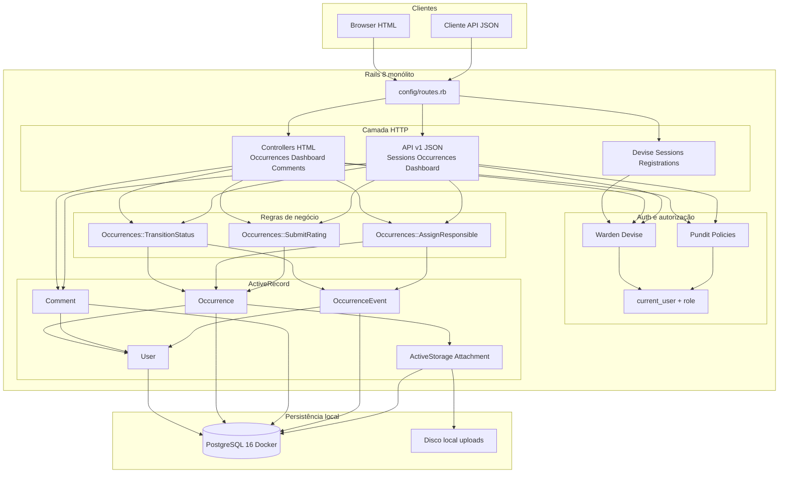

# Arquitetura — Resolve Aí

Monólito **Rails 8** (HTML Phlex/RubyUI + JSON na mesma app). Sem SPA, sem Redis/Sidekiq, sem tenancy. PostgreSQL 16 no Docker; uploads no disco via Active Storage.

## Papéis

| Papel no código | Perfil | Como nasce |
| --------------- | ------ | ---------- |
| `requester` | Solicitante | Cadastro público (tela `GET /users/sign_up`, envio `POST /users`) sempre força esse papel |
| `manager` | Gestor | Seed (`manager@resolve.ai`) ou console |

## Enums (código / interface)

O domínio usa chaves em inglês no banco; a UI pt-BR traduz.

| Campo | Valores |
| ----- | ------- |
| Status | `open` (aberta), `in_analysis` (em análise), `in_progress` (em atendimento), `resolved` (resolvida), `cancel` (cancelada) |
| Prioridade | `low`, `medium` (padrão), `high`, `urgent` — só gestor altera |
| Categoria | `lighting`, `equipment`, `accessibility`, `cleaning`, `leakage`, `security`, `maintenance`, `other` |

## Testes

- **RSpec** + FactoryBot (modelos, policies, serviços, requests HTML/JSON, componentes): `bundle exec rspec`
