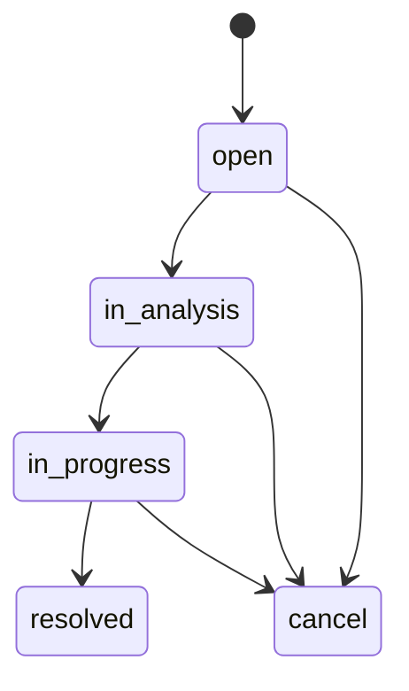

# Ciclo de vida da ocorrência

Transições **não** são livres: `Occurrence::STATUS_TRANSITIONS` e `Occurrences::TransitionStatus` (observação obrigatória; `resolution_notes` ao resolver).

| De | Para permitidos |
| -- | --------------- |
| `open` | `in_analysis`, `cancel` |
| `in_analysis` | `in_progress`, `cancel` |
| `in_progress` | `resolved`, `cancel` |
| `resolved` / `cancel` | nenhum |

Cada mudança de status grava `OccurrenceEvent` (`event_type: status_changed`, `from_status`, `to_status`, `user`, `note`). Atribuição de responsável e mudança de prioridade usam o mesmo modelo (`assignee_changed`, `priority_changed`).

Avaliação (`rating` 1–5) só é válida com status `resolved` e apenas para o `reporter`.
