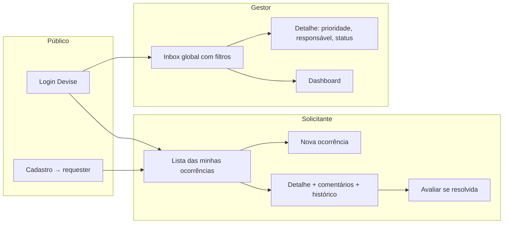

# Fluxos por perfil

## Solicitante

1. Entra em **Minhas ocorrências** (`GET /occurrences`) — Pundit limita ao `reporter_id` do usuário.
2. Abre **Nova ocorrência**: título, descrição, categoria, localização (texto) e foto opcional.
3. No detalhe: acompanha status, comenta, vê `occurrence_events`.
4. Quando o status é `resolved`, avalia (1–5 + comentário). Só o dono, só uma vez.

Não vê a inbox global, não abre ocorrência de outro morador, não muda prioridade/status/responsável, não acessa o dashboard.

## Gestor

1. **Inbox** lista todas as ocorrências. Filtros: `status`, `category`, `priority`.
2. No detalhe, nesta ordem típica: prioridade → responsável (`assignee` gestor) → avançar status **com observação obrigatória** → preencher `resolution_notes` ao marcar `resolved`.
3. **Dashboard** (`GET /dashboard`): totais por status e categoria, abertas vs resolvidas, tempo médio de resolução.

## API

Os mesmos casos existem em `/api/v1` com cookie de sessão Devise. Mapa e `curl` estão no [README](../README.md).
